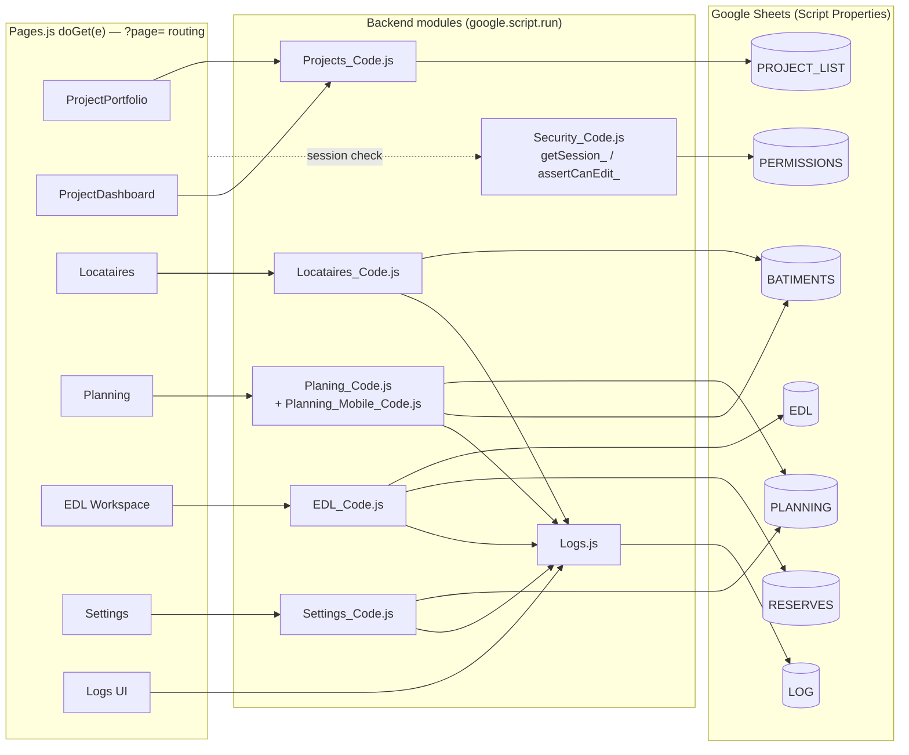

# Architecture

Stable structural reference: modules, data model, request/auth flow. Read this first when
orienting on the system. `current-state.md` holds session-dated findings and open issues instead
of duplicating them here — this file describes shape, not status.

## System overview

**Ehden Vision** — a French-language construction/renovation project-management web app: tenant
("Locataires") and building info, a multi-view construction Planning/Gantt, a per-lot "Workspace"
(EDL/Travaux/Réserves and stubs), a punch-list ("Réserves") workflow, and a universal audit log.
The live stack is Google Apps Script + Google Sheets, developed and tested directly against
Google Workspace (`Webapp Files/`, a `clasp clone` — the real, editable app, not a legacy copy).
The plan is a *progressive* migration: keep building against Apps Script + Sheets so the app
stays testable online throughout, and only cut over to a dedicated stack once functionally
complete. Target stack for that cutover is not yet decided — see `agents/decisions.md`.

## Hosting & request model

One Apps Script project, one entry point: `Pages.js`'s `doGet(e)` routes a `?page=` query param
to a `render_()` call that serves a full server-rendered HTML template — not a client-rendered
SPA. Each page is its own HTML document; navigation (`navTo`/`navToWithParams` in
`ClientLib.html`) does a full top-window redirect, carrying the session token and project context
as URL params + `localStorage`. Desktop and Mobile are separate templates picked by `?view=mobile`
(not every page has a mobile variant — see "Known architectural gaps").

Client-server communication is exclusively `google.script.run` calls from the page's inline/HTML
client scripts into backend functions exposed on the `.js` server files — roughly 90 functions
across all modules. There is no `doPost`, no REST layer, no fetch-based API.

## Data architecture

Google Sheets are the database. Spreadsheets are referenced only by ID via
`PropertiesService.getScriptProperties()` — no ID is ever hardcoded in code, and all of them were
bootstrapped once from a "Script Properties" sheet via `Import_Properties.js`. Each group below
maps to one spreadsheet (one Script Property) and is owned by the corresponding module:

- **`PERMISSIONS_SPREADSHEET_ID`** — `Utilisateurs` sheet: login credentials and roles. Owned by
  Auth (`Login_Code.js`, `Security_Code.js`).
- **`PROJECT_LIST_ID`** — `Projects` sheet: the project portfolio. Owned by Projects
  (`Projects_Code.js`).
- **`BATIMENTS_SPREADSHEET_ID`** — `Locataires`, `Parties communes`, `Facades` sheets: the
  tenant/building "source of truth" for all three Locataires sub-views. Owned by Locataires
  (`Locataires_Code.js`) but also read by Planning to resolve unit metadata.
- **`PLANNING_SPREADSHEET_ID`** — `Planning`, `Planning Communs`, `Planning Facades`, plus
  `Recap*`, `avancement*`, `Taches`, `Cycles`, `Equipes`, `Disciplines`, `Conges` (holidays),
  `Notes*`: the date-grid schedule and its supporting config sheets, one set per view. Owned by
  Planning (`Planing_Code.js`, `Planning_Mobile_Code.js`) and partly by Settings (holidays).
- **`RESERVES_SPREADSHEET_ID`** — `Reserves`, `Reserves Communs`, `Reserves Facades`,
  `AutoControle*`, `Summary`: the punch-list/snag-list data. Owned by the Réserves/Autocontrôle
  layer inside `EDL_Code.js`.
- **`EDL_SPREADSHEET_ID`** — `EDL Notes`, `EDL Photos`, `Config Travaux`, `Données Travaux`, plus
  a sous-catégories sheet: état-des-lieux notes/photos and the Travaux (works) config/data. Owned
  by `EDL_Code.js`.
- **`LOG_SPREADSHEET_ID`** — auto-created `Logs_<module>` sheets plus `Errors`: the universal
  audit log. Owned by `Logs.js`, written to by every other module.
- **`PROJECT_PHOTOS_FILE`** — a Drive folder (not a spreadsheet) for photos/plans/icons.
- **`COMPANY_NAME`** / **`COMPANY_LOGO`** — branding config, not project data.

Each of Locataires/Planning/Réserves is split into three parallel "views" of the same shape —
**logements** (apartments), **parties communes** (common areas), and **façades** — each with its
own source/plan/recap/reserves sheet set, selected by a `currentView` parameter passed through
the backend calls.

## Auth & authorization

Custom email/password auth, not Google identity: `Login_Code.js` checks a salted SHA-256 hash
against the `Utilisateurs` sheet. Sessions are a UUID token held in `CacheService` (6h TTL,
`SESSION_CACHE_PREFIX`) — validated server-side on essentially every backend call via
`getSession_()`, with a stricter `assertCanEdit_()` gate (session + role + project-status check)
used by every write path. Password reset is an emailed one-time `CacheService` token (1h TTL).

Roles: `admin` / `directeur` / `collaborateur` can edit; `viseur` and anything else fall through
to a read-only "client" account (`isClient`). `isClient` does more than block writes — Planning
filters out `A-` (Autocontrôle) items for client sessions, and Logs strips any `details` key
matching `priv*` (recursively) before returning results to a client session. A staff-only "Vue
Client" toggle exists purely for QA — it simulates the same filtering client-side without being
an actual security boundary; the real boundary is server-side in `getSession_()`/`gsGetUniversalLog`.

## Domain modules

- **Projects / Portfolio** (`Projects_Code.js`, `ProjectPortfolio.html`,
  `ProjectDashboard(Mobile).html`) — the project list and per-project dashboard; every other
  module operates within a `projectId` selected here.
- **Locataires** (`Locataires_Code.js`, `Locataires.html`/`LocatairesMobile.html`) — tenant and
  building data grid across the three sub-views (logements/parties communes/façades); also owns
  the "planning-only" cells (status/comment) that Planning displays per unit.
- **Planning** (`Planing_Code.js`, `Planning_Mobile_Code.js`, `Planning*.html`) — the horizontal
  date-grid schedule at the core of the original architecture sketch: `gsGetPlanningWindow` and
  `getProjectDateBounds` remain its central functions, extended since with `projectId`,
  multi-view support, and client filtering. Also handles tasks, disciplines, équipes (teams),
  cycles, the holiday calendar, and drag/shift rescheduling with a "domino cascade" that pushes
  dependent tasks. Desktop and mobile have separate backend read paths (the mobile file's own
  comments cite the desktop functions as the reference implementation it must mirror).
- **EDL "Workspace"** (`EDL_Code.js`, `EDL.html` + `EDL_Scripts_1..4.html`) — a per-lot shell
  hosting six pluggable layers via a `WorkspaceCore.registerLayer()` pattern: **EDL** (état des
  lieux — room notes/photos), **Travaux** (dynamic per-discipline work-config form), and
  **Réserves/Autocontrôle** (punch-list intervention workflow with validation and history) are
  implemented; **Élec**, **Sanit**, and **Formulaires** are intentional "à venir" stub layers.
- **Settings** (`Settings_Code.js`, `Settings.html`) — project generation/config and the holiday
  calendar (fixed + custom overrides, working/non-working toggle) that Planning consumes.
- **Logs** (`Logs.js`) — universal cross-module audit log: every module writes to its own
  auto-created `Logs_<module>` sheet via `gsWriteUniversalLog`; read back via
  `gsGetUniversalLog`, which enforces the client/staff visibility filtering described above. Also
  handles error logging (`gsWriteErrorLog`).

## Diagram

## Known architectural gaps

Structural gaps worth knowing before building on top of them; see `agents/current-state.md` for
the full, dated writeup of each:

- `Pages.js` currently hardcodes `DEV_MODE = true`, bypassing real login with a fixed admin
  session — must be `false` before this is shared beyond the sandbox.
- Several sidebar nav items (`rapport`, `avancement`, `opr`, `passage`, `plans`, `documents`,
  `quitus`, `reclamations`, `satisfaction`, `sous-traitants`, `synoptiques`, `auto-controles`,
  plus mobile variants of `settings` and `edl`) have no case in `doGet`'s switch or a missing
  HTML file, and silently fall through to ProjectPortfolio instead of erroring.

## Relationship to the original snippet

The user's original architecture note (written when the project started, used since as an
informal guideline) described `gsGetPlanningWindow`/`getProjectDateBounds` reading three
spreadsheets (Planning hub, Locataires source, hourly repair log) into one combined JSON. That
core algorithm is unchanged today — same date-window column scan, same row-7 grid layout, same
row-7/col-2/13-column source metadata. What's been added since: the full auth/role/session layer,
the three-way view split (logements/parties communes/façades) across Locataires/Planning/Réserves,
the EDL "Workspace" 6-layer module, the universal cross-module audit log, mobile variants, and the
Projects/Portfolio layer that everything else now sits under. Separately — and unrelated to this
snippet — a full Node/Express/Prisma/React rewrite attempt (`app/`) was built to
proof-of-concept and then removed from the repo (commit `09f2bef`); it's not part of the current
system but is recoverable from git history at commit `14ddb41` if ever useful for reference.
